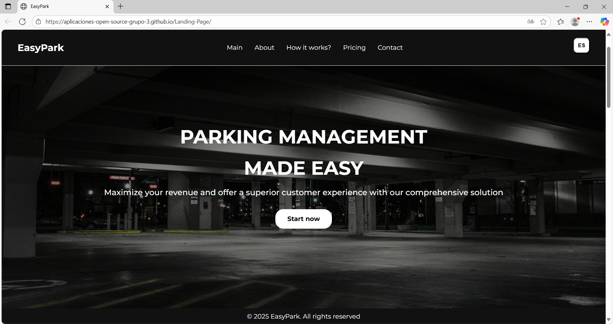
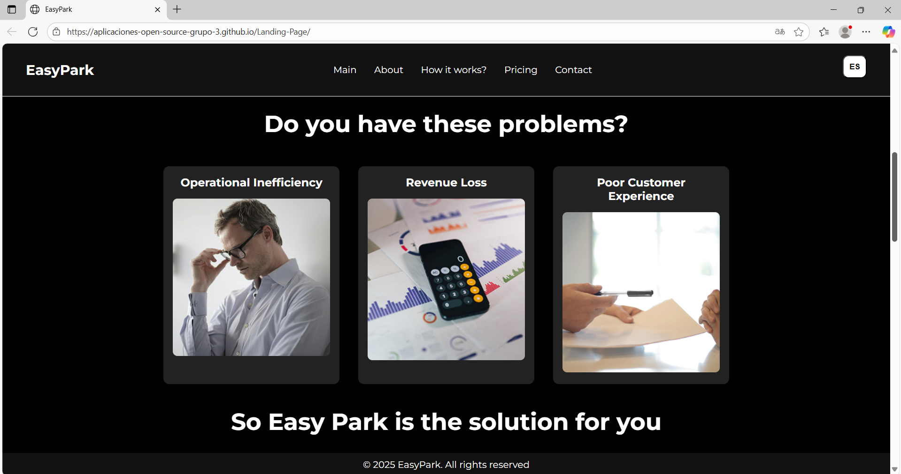
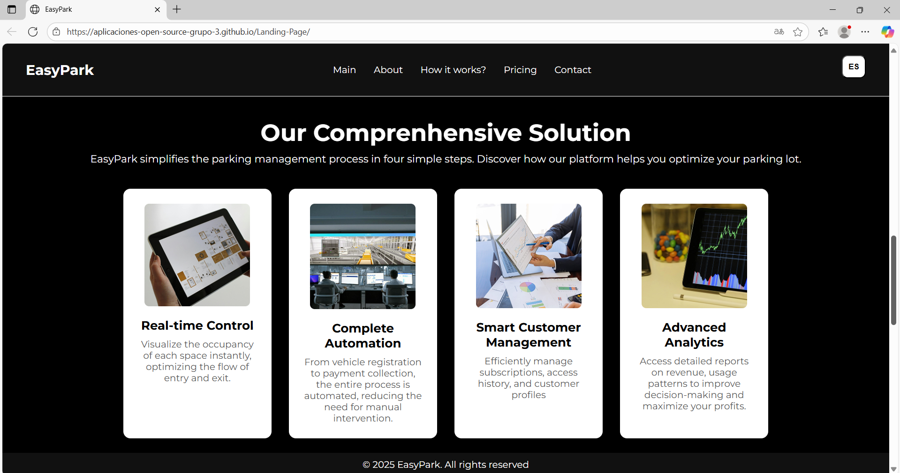
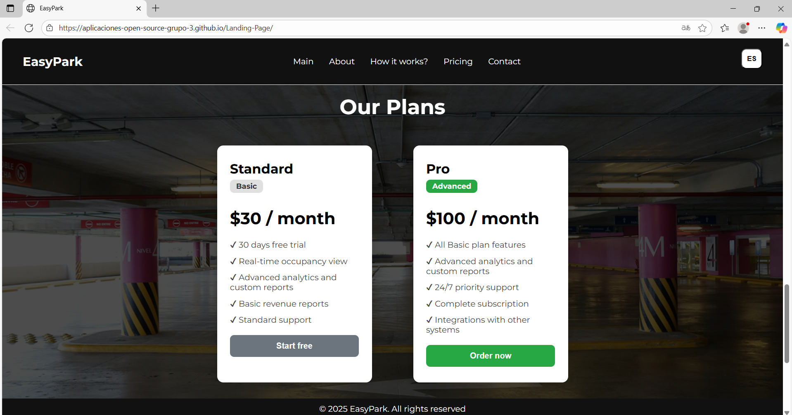
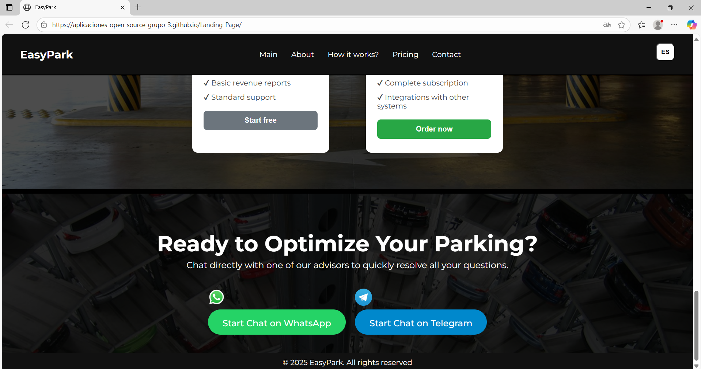
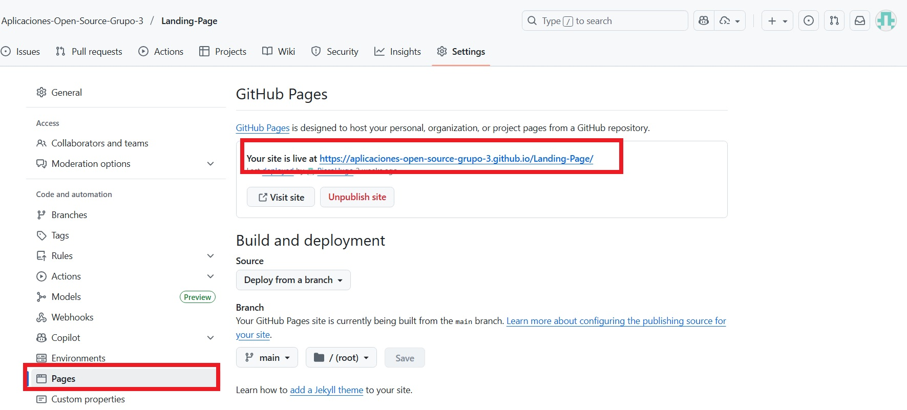
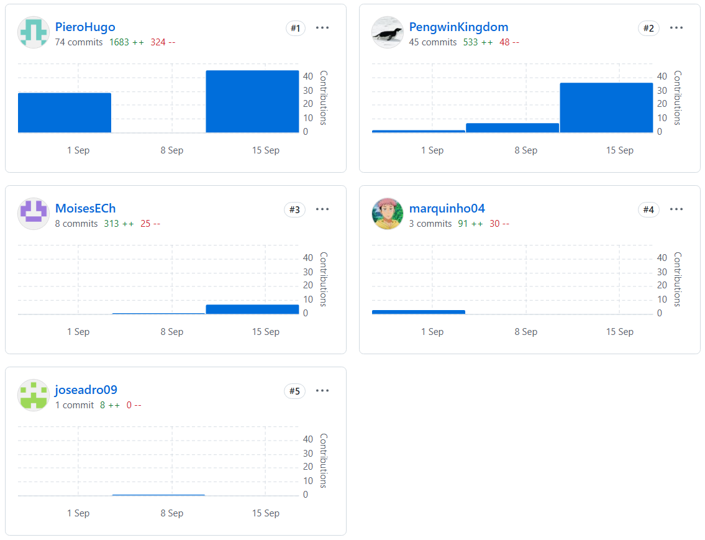

# Capítulo V: Product Implementation, Validation & Deployment
## 5.1. Software Configuration Management.
A continuación se presenta la gestión centralizada y estructurada del repositorio como referencia fundamental para el desarrollo de EasyPark. Se describen las herramientas y metodologías que han permitido mantener coherencia, trazabilidad y calidad en todas las fases del ciclo de vida del software.

### 5.1.1. Software Development Environment Configuration.
Para construir EasyPark, se definió un entorno de desarrollo eficiente y colaborativo, alineado con las necesidades de una aplicación web de gestión de estacionamientos. Se emplearon las siguientes herramientas y plataformas:

- **WebStorm:** IDEs utilizados para desarrollo frontend.
- **Rider:** Para desarrollo backend, encargados de la lógica de negocio y servicios web.
- **Git:** Control de versiones local y coordinación de trabajo colaborativo.
- **GitHub:** Plataforma de gestión del repositorio central, issues, pull requests y documentación técnica.
- **Figma/Miro:** Diseño de interfaces, prototipos y colaboración UX/UI.

## Gestión del Proyecto

En EasyPark, la gestión del proyecto fue clave para coordinar actividades, tareas y equipos, asegurando el avance dentro de los plazos y objetivos definidos para transformar la gestión de estacionamientos en Lima.

**Modelo SaaS Web:**  
Se optó por una solución web en la nube, accesible vía navegador, que permite planificación, seguimiento y colaboración sin necesidad de instalaciones locales.
Durante el desarrollo, se utilizó una solución basada en la nube accesible vía navegador, permitiendo la planificación, seguimiento de tareas y colaboración, sin la necesidad de instalar la aplicaion en las computadoras de los usuarios.

## Gestión de Requisitos
El levantamiento y seguimiento de requisitos funcionales y no funcionales fue fundamental para garantizar que EasyPark respondiera a las necesidades de administradores y operadores de estacionamientos.

**Pivotal Tracker:**  
Gestión de historias de usuario, épicas, prioridades y seguimiento del flujo de trabajo ágil.
## Diseño UX/UI del Producto
EasyPark se diseñó con enfoque centrado en el usuario, garantizando una interfaz intuitiva y accesible desde todo tipo de dispositivos.
**Herramientas utilizadas:**
- **Figma:** Prototipos interactivos y diseño visual responsive.
- **Miro:** Mapas de empatía, user personas, customer journey maps y lluvias de ideas colaborativas.
- **Lucidchart:** Diagramas UML, arquitecturas y flujos operativos.
- **Overflow:** Visualización de flujos de usuario y recorridos críticos en la app.
## Desarrollo de Software
- **GitHub:** Repositorio central del código fuente y control de versiones de EasyPark.
- **Git:** Gestión de ramas, cambios y colaboración.
- **IDE (WebStorm/Rider):** Entornos de desarrollo adaptados a frontend y backend.
## Pruebas de Software
El objetivo de esta fase fue validar y verificar el correcto funcionamiento del sistema, asegurando confiabilidad en los procesos críticos de gestión de estacionamientos.

- **Lenguaje Gherkin:** Redacción de escenarios de usuario y automatización de pruebas basadas en comportamiento esperado.
- **Testing:** Cobertura de las funcionalidades clave como gestión de espacios, cobros, reportes y reservas.

## Documentación del Software
La documentación de EasyPark describe el funcionamiento del sistema tanto para usuarios finales como para el equipo técnico. Todo el material se integra en el repositorio y en la wiki de GitHub.

### 5.1.2. Source Code Management.
EasyPark implementa prácticas robustas para la gestión del código:

#### Plataforma de Control de Versiones

- **GitHub** es la plataforma centralizada para el control y seguimiento del código fuente. Se utiliza un único repositorio principal, con ramas y flujos dedicados para cada componente: backend, frontend y landing page.

#### Flujo de Trabajo Git (GitFlow)

Se adoptó **GitFlow** para mantener orden y facilitar la colaboración:

- **Ramas principales:**
  - `main`: Versión estable y lista para producción de EasyPark.
  - `develop`: Integración y pruebas previas a lanzamientos.
- **Ramas de apoyo:**
  - `feature`: Funcionalidades nuevas.
  - `release`: Preparación de nuevas versiones estables.
  - `hotfix`: Corrección de errores críticos en producción.

#### Versionado Semántico (Semantic Versioning)

EasyPark sigue el estándar **Semantic Versioning 2.0.0** (`X.Y.Z`):

- `X`: Cambios incompatibles.
- `Y`: Nuevas funcionalidades compatibles.
- `Z`: Parches y correcciones menores.

#### Commits Convencionales (Conventional Commits)

Para asegurar trazabilidad y claridad:

```
<type>[opcional scope]: <descripción>
[optional body]
[optional footer]
```

- `feat`: Nueva funcionalidad.
- `fix`: Corrección de errores.
- `docs`: Documentación.
- `refactor`, `perf`, `chore`, `build`.

Este enfoque facilita la automatización, el versionado y la revisión colaborativa.

### 5.1.3. Source Code Style Guide & Conventions.
En esta parte del proyecto, se centra en definir un conjunto uniforme de normas y convenciones de estilo y programación para el desarrollo de nuestra aplicación web EasyPark. Estas pautas son fundamentales para asegurar que el código sea consistente, claro y bien estructurado, lo que a su vez facilitará su mantenimiento y escalabilidad durante todo el ciclo de vida del proyecto.

EasyPark mantiene un conjunto uniforme de normas para HTML, CSS y JavaScript, asegurando consistencia y calidad:

#### HTML
- Uso de `<!DOCTYPE html>`, etiquetas en minúsculas, atributos entre comillas dobles.
- Comentarios claros y estructura semántica.
- Recursos enlazados correctamente.

#### CSS
- Nombres de clases/IDs en inglés y formato kebab-case.
- Uso correcto de llaves, punto y coma, y media queries para responsive design.

#### JavaScript
- `const` y `let` para variables, sin `var`.
- Funciones claras y con propósito único.
- Delegación de eventos y uso de listeners.

### 5.1.4. Software Deployment Configuration.

El despliegue de EasyPark cubre tres componentes: Landing Page, Backend y Frontend.

#### Landing Page

Se utiliza **GitHub Pages** para el despliegue, permitiendo acceso público sencillo y actualizaciones rápidas. El proceso incluye:

1. Selección de rama a desplegar desde Settings -> Pages en GitHub.
2. Espera de propagación y verificación del enlace de acceso.

#### Backend y Frontend

- Despliegue en servidores en la nube (Azure, AWS, Vercel, etc.) o contenedores Docker, según el entorno de producción requerido.
- Integración continua con GitHub Actions para automatizar pruebas y despliegues.
  
## 5.2. Landing Page, Services & Applications Implementation.
Esta sección detalla el proceso de desarrollo, pruebas, documentación y despliegue de la Landing Page, servicios web y aplicaciones frontend de EasyPark.

### 5.2.1. Sprint 1
Se documenta el trabajo colaborativo y las fases clave del Sprint 1, desde el sprint planning, desarrollo incremental y retrospectiva, alineados con los objetivos de digitalización y optimización de la gestión de estacionamientos.

#### 5.2.1.1. Sprint Planning 1.
Aquí se especifican los objetivos, historias de usuario priorizadas y entregables mínimos viables definidos para la primera iteración de EasyPark.

<table>
	<tbody>
		<tr>
			<td><strong>Sprint #</strong></td>
			<td>Sprint 1</td>
		</tr>
		<tr>
			<td colspan="2"><strong>Spring Planning Background</strong></td>
		</tr>
		<tr>
			<td><strong>Date</strong></td>
			<td>2025-09-3</td>
		</tr>
		<tr>
			<td><strong>Time</strong></td>
			<td>10:30 PM</td>
		</tr>
		<tr>
			<td><strong>Location</strong></td>
			<td>Remote mode through the GitHub platform</td>
		</tr>
		<tr>
			<td colspan="2"><strong>Prepared by</strong></td>
		</tr>
		<tr>
			<td><strong>Attendees (to planinning meeting)</strong></td>
			<td>All members of EasyPark</td>
		</tr>
		<tr>
			<td><strong>Sprint 0 Review Summary</strong></td>
			<td>Since this is our initial development sprint, a sprint summary has not yet been completed.</td>
		</tr>
		<tr>
			<td><strong>Sprint 0 Retrospective Summary</strong></td>
			<td>Since this is our initial development sprint, a sprint summary has not yet been completed.</td>
		</tr>
		<tr>
			<td colspan="2"><strong>Sprint Goal & User Stories</strong></td>
		</tr>
		<tr>
			<td><strong>Sprint 1 Goal</strong></td>
			<td>We are focused on building the EasyPark landing page, as we believe this is critical for the long-term sustainability of the product within the organization. We will confirm its success when we see a significant increase in user engagement.</td>
		</tr>
		<tr>
			<td><strong>Sprint 1 Velocity</strong></td>
			<td>10</td>
		</tr>
		<tr>
			<td><strong>Sum of Story points</strong></td>
			<td>18</td>
		</tr>
	</tbody>
</table>

*Tabla 5.2.1.1. Sprint Planning 1.*


#### 5.2.1.2. Aspect Leaders and Collaborators.
En esta sección se presenta la elaboración de el artefacto Leadership-andCollaboration Matrix (LACX), el cual se presenta al líder y los colaboradores de este Sprint 1.

| Team Member (Last Name, First Name) | GitHub Username | Landing page |
| ------------------------------------|-----------------|-------------------------------------------|
| Elescano Leon, Piero Hugo | PieroHugo | L |
| Espinoza Chavez, Moises Filemon |MoisesECh| C | 
| Florez Shimabukuro, Fátima Belén |PengwinKingdom| C |
| Nakasone Gomes, Marco Antonio  | marquinho04 | C | 
| Paredes Davila, Jose Adrian  | joseadro09 | C | 

*Tabla 5.2.1.2. Aspect Leaders and Collaborators.*

#### 5.2.1.3. Sprint Backlog 1
El principal objetivo del primer sprint es desarrollar las funciones esenciales que permitan a los usuarios interesados en EasyPark informarse sobre su propósito, conocer sus características destacadas y entender las acciones que podrán realizar dentro de la aplicacion web.

<table>
  <tr>
    <td><strong>Sprint #</strong></td>
    <td colspan="7">Sprint 1</td>
  </tr>
  <tr>
    <td colspan="2"><strong>User Story</strong></td>
    <td colspan="6"><strong>Work-item / Task</strong></td>
  </tr>
  <tr>
    <td><strong>Id</strong></td>
    <td><strong>Title</strong></td>
    <td><strong>Id</strong></td>
    <td><strong>Title</strong></td>
    <td><strong>Description</strong></td>
    <td><strong>Estimation (Hours)</strong></td>
    <td><strong>Assigned To</strong></td>
    <td><strong>Status (To-do / In-Process / To-review / Done)</strong></td>
  </tr>

  <!-- EP05-US01 Información general EasyPark -->
  <tr>
    <td rowspan="2">EP05-US01</td>
    <td rowspan="2">Información general EasyPark</td>
    <td>T1</td>
    <td>Redactar descripción de EasyPark</td>
    <td>Redactar una descripción clara y concisa sobre EasyPark para la landing page.</td>
    <td>1</td>
    <td>Piero Elescano</td>
    <td>Done</td>
  </tr>
  <tr>
    <td>T2</td>
    <td>Agregar sección de información general</td>
    <td>Implementar la sección en el HTML y aplicar estilos.</td>
    <td>1</td>
    <td>Moises Espinoza</td>
    <td>Done</td>
  </tr>

  <!-- EP05-US02 Características destacadas -->
  <tr>
    <td rowspan="2">EP05-US02</td>
    <td rowspan="2">Características destacadas</td>
    <td>T3</td>
    <td>Listar beneficios y características</td>
    <td>Definir y listar los beneficios y características clave del sistema.</td>
    <td>0.5</td>
    <td>Fátima Florez</td>
    <td>Done</td>
  </tr>
  <tr>
    <td>T4</td>
    <td>Diseño sección de beneficios</td>
    <td>Agregar y estilizar la sección de características en la landing.</td>
    <td>1</td>
    <td>Moises Espinoza</td>
    <td>Done</td>
  </tr>

  <!-- EP05-US03 Planes y precios -->
  <tr>
    <td rowspan="2">EP05-US03</td>
    <td rowspan="2">Planes y precios</td>
    <td>T5</td>
    <td>Definir estructura de planes</td>
    <td>Redactar planes y precios ofrecidos por EasyPark.</td>
    <td>0.5</td>
    <td>Fátima Florez</td>
    <td>Done</td>
  </tr>
  <tr>
    <td>T6</td>
    <td>Implementar sección de planes y precios</td>
    <td>Maquetar e implementar la sección en la landing page.</td>
    <td>1</td>
    <td>Marco Nakasone</td>
    <td>Done</td>
  </tr>

  <!-- EP05-US04 Formulario de contacto -->
  <tr>
    <td rowspan="2">EP05-US04</td>
    <td rowspan="2">Formulario de contacto</td>
    <td>T7</td>
    <td>Diseñar formulario de contacto</td>
    <td>Diseñar y prototipar el formulario de contacto.</td>
    <td>0.5</td>
    <td>Fátima Florez</td>
    <td>Done</td>
  </tr>
  <tr>
    <td>T8</td>
    <td>Implementar funcionalidad del formulario</td>
    <td>Hacer funcional el formulario, validación y almacenamiento.</td>
    <td>1</td>
    <td>Piero Elescano</td>
    <td>Done</td>
  </tr>

  <!-- EP05-US05 Testimonios de clientes -->
  <tr>
    <td rowspan="2">EP05-US05</td>
    <td rowspan="2">Testimonios de clientes</td>
    <td>T9</td>
    <td>Recolectar testimonios/entrevistas</td>
    <td>Solicitar y redactar testimonios de clientes reales.</td>
    <td>0.5</td>
    <td>Jose Paredes</td>
    <td>Done</td>
  </tr>
  <tr>
    <td>T10</td>
    <td>Analizar las entrevistas</td>
    <td>Analisis de la informacion recolectada.</td>
    <td>1</td>
    <td>Moises Espinoza</td>
    <td>Done</td>
  </tr>

  <!-- EP05-US08 Enlaces a redes sociales -->
  <tr>
    <td>EP05-US08</td>
    <td>Enlaces a redes sociales</td>
    <td>T11</td>
    <td>Agregar enlaces a redes sociales</td>
    <td>Colocar íconos y enlaces a redes sociales oficiales en la landing.</td>
    <td>0.5</td>
    <td>Jose Paredes</td>
    <td>Done</td>
  </tr>

  <!-- EP05-US10 Accesibilidad y responsive -->
  <tr>
    <td rowspan="2">EP05-US10</td>
    <td rowspan="2">Accesibilidad y responsive</td>
    <td>T12</td>
    <td>Garantizar responsive design</td>
    <td>Aplicar media queries y pruebas en diferentes dispositivos.</td>
    <td>1</td>
    <td>Piero Elescano</td>
    <td>Done</td>
  </tr>
  <tr>
    <td>T13</td>
    <td>Test de accesibilidad</td>
    <td>Verificar el cumplimiento de estándares básicos de accesibilidad.</td>
    <td>1</td>
    <td>Fátima Florez</td>
    <td>Done</td>
  </tr>

  <!-- EP05-US19 Visualización de tarifas -->
  <tr>
    <td rowspan="2">EP05-US19</td>
    <td rowspan="2">Visualización de tarifas</td>
    <td>T14</td>
    <td>Redactar información de tarifas</td>
    <td>Redactar y actualizar la información sobre las tarifas del servicio EasyPark para la landing.</td>
    <td>0.5</td>
    <td>Marco Nakasone</td>
    <td>Done</td>
  </tr>
  <tr>
    <td>T15</td>
    <td>Agregar sección de tarifas en la landing</td>
    <td>Diseñar y maquetar la sección de tarifas, asegurando claridad y visibilidad.</td>
    <td>1</td>
    <td>Moises Espinoza</td>
    <td>Done</td>
  </tr>

  <!-- NUEVA SECCIÓN: EP05-US21 Recepción de notificaciones -->
  <tr>
    <td rowspan="2">EP05-US21</td>
    <td rowspan="2">Recepción de notificaciones</td>
    <td>T16</td>
    <td>Redactar beneficios de notificaciones</td>
    <td>Redactar una breve descripción sobre las ventajas de las notificaciones en EasyPark.</td>
    <td>0.5</td>
    <td>Fátima Florez</td>
    <td>Done</td>
  </tr>
  <tr>
    <td>T17</td>
    <td>Maquetar sección de notificaciones en la landing</td>
    <td>Diseñar y agregar la sección de notificaciones a la landing page.</td>
    <td>1</td>
    <td>Marco Nakasone</td>
    <td>Done</td>
  </tr>
</table>

*Tabla 5.2.1.3. Sprint Backlog 1.*


#### 5.2.1.4. Development Evidence for Sprint Review
Para el Sprint 1, se presenta la evidencia de desarrollo de la landing page de EasyPark. Los commits registrados en el repositorio corresponden a la implementación de las secciones clave de la página. Esto se realizó siguiendo el diseño previo en Figma.

| Repository                        | Branch                  | Commit Message                                 | Commited on  |
|------------------------------------|-------------------------|------------------------------------------------|--------------|
| PieroHugo/Landing-Page             | main                    | initial commit                                 | 10/09/2025   |
| PieroHugo/Landing-Page             | develop                 | initial commit                                 | 10/09/2025   |
| PieroHugo/Landing-Page             | feature/structure-landing | feat: add landing page structure               | 11/09/2025   |
| PieroHugo/Landing-Page             | feature/structure-landing | feat: implement info section, styles           | 12/09/2025   |
| PieroHugo/Landing-Page             | feature/structure-landing | feat: add responsive and accessibility         | 13/09/2025   |
| PieroHugo/Landing-Page             | feature/structure-landing | fix: update content and images                 | 14/09/2025   |
| PieroHugo/Landing-Page             | feature/structure-landing | docs: add README with usage                    | 15/09/2025   |
| PieroHugo/Landing-Page             | feature/structure-landing | chore: minor refactor                          | 16/09/2025   |
| MoisesECh/Landing-Page             | feature/structure-landing | feat: benefits & features section              | 12/09/2025   |
| MoisesECh/Landing-Page             | feature/structure-landing | feat: add testimonials section                 | 13/09/2025   |
| MoisesECh/Landing-Page             | feature/structure-landing | fix: section layout and css improvements       | 14/09/2025   |
| MoisesECh/Landing-Page             | feature/structure-landing | feat: implement notification section           | 15/09/2025   |
| PengwinKingdom/Landing-Page        | feature/structure-landing | feat: add features list to landing             | 12/09/2025   |
| PengwinKingdom/Landing-Page        | feature/structure-landing | feat: add plans & pricing section              | 13/09/2025   |
| PengwinKingdom/Landing-Page        | feature/structure-landing | fix: improve form validation                   | 14/09/2025   |
| PengwinKingdom/Landing-Page        | feature/structure-landing | feat: add notification advantages section      | 15/09/2025   |
| marquinho04/Landing-Page           | feature/structure-landing | feat: add plans & pricing markup               | 13/09/2025   |
| marquinho04/Landing-Page           | feature/structure-landing | feat: FAQ & notification sections              | 14/09/2025   |
| marquinho04/Landing-Page           | feature/structure-landing | fix: responsive grid for landing               | 16/09/2025   |
| joseadro09/Landing-Page            | feature/structure-landing | feat: collect and add testimonials             | 13/09/2025   |
| joseadro09/Landing-Page            | feature/structure-landing | feat: add social media links section           | 14/09/2025   |
| joseadro09/Landing-Page            | feature/structure-landing | fix: improve testimonials style and markup     | 16/09/2025   |

*Tabla 5.2.1.4. Development Evidence for Sprint Review.*


#### 5.2.1.5. Execution Evidence for Sprint Review.

El equipo de desarrolladores logró concluir con el sprint 1, el cual involucra la implementación y despliegue de la landing page de EasyPark. A continuación se presentan las evidencias.
#### Landing page desplegada

*Figura 5.2.1.5-1. Landing page desplegada 1.*


*Figura 5.2.1.5-2. Landing page desplegada 2.*


*Figura 5.2.1.5-3. Landing page desplegada 3.*


*Figura 5.2.1.5-4. Landing page desplegada 4.*


*Figura 5.2.1.5-5. Landing page desplegada 5.*


#### 5.2.1.6. Services Documentation Evidence for Sprint Review.

En este sprint no se cuenta la documentacion a razón que el primer sprint esta dirigido a la elaboración del landing page.

#### 5.2.1.7. Software Deployment Evidence for Sprint Review
En el desarrollo del Sprint 1 para EasyPark, se utilizó GitHub Pages para el despliegue de la página de aterrizaje. Esta herramienta se integró de manera fluida al flujo de trabajo, permitiendo el despliegue directo desde el repositorio. Además, se llevaron a cabo actividades específicas para preparar el entorno de despliegue.
#### Despliegue realizado en GitHub pages

*Figura 5.2.1.7-1. Despliegue en GitHub pages.*

Enlace de la Landing Page: https://aplicaciones-open-source-grupo-3.github.io/Landing-Page/


*Figura 5.2.1.7-2. Landing Page en GitHub pages.*

#### 5.2.1.8. Team Collaboration Insights during Sprint.
En esta seccion se evidencia el trabajo colaborativo del equipo de desarrollo de la primera parte del proyecto.


*Figura 5.2.1.8. Team Collaboration Insights during Sprint.*


### 5.2.2. Sprint 2
Se documenta el trabajo colaborativo y las fases clave del Sprint 2, desde el sprint planning, desarrollo incremental y retrospectiva. El Sprint 2 se enfoca en habilitar el pago end-to-end con pasarela sandbox, persistir transacciones y reflejarlas en un dashboard básico, alineado con la optimización de la gestión de estacionamientos.

#### 5.2.2.1. Sprint Planning 2.
Aquí se especifican los objetivos, historias de usuario priorizadas y entregables mínimos viables definidos para la segunda iteración de EasyPark.

<table>
	<tbody>
		<tr>
			<td><strong>Sprint #</strong></td>
			<td>Sprint 2</td>
		</tr>
		<tr>
			<td colspan="2"><strong>Spring Planning Background</strong></td>
		</tr>
		<tr>
			<td><strong>Date</strong></td>
			<td>2025-10-1</td>
		</tr>
		<tr>
			<td><strong>Time</strong></td>
			<td>10:30 AM</td>
		</tr>
		<tr>
			<td><strong>Location</strong></td>
			<td>Remote mode through the GitHub platform</td>
		</tr>
		<tr>
			<td colspan="2"><strong>Prepared by</strong></td>
		</tr>
		<tr>
			<td><strong>Attendees (to planinning meeting)</strong></td>
			<td>All members of EasyPark</td>
		</tr>
		<tr>
			<td><strong>Sprint 1 Review Summary</strong></td>
			<td>We delivered and deployed the first public version of the EasyPark landing page via GitHub Pages. It included top navigation, hero, benefits, pricing, testimonials, contact form with basic validation, social links, and responsive/accessibility adjustments. </td>
		</tr>
		<tr>
			<td><strong>Sprint 1 Retrospective Summary</strong></td>
			<td>We worked well by splitting tasks clearly and keeping daily async check-ins.</td>
		</tr>
		<tr>
			<td colspan="2"><strong>Sprint Goal & User Stories</strong></td>
		</tr>
		<tr>
			<td><strong>Spritn 2 Goal</strong></td>
			<td>Deliver a navigable Operator Panel MVP using mock data (<code>db.json</code>), 
        EN/ES i18n, unified styles, and read-only views: Dashboard, Reports,
        Parking Setup, Spaces, Prices/Subscriptions, and Clients.</td>
		</tr>
		<tr>
			<td><strong>Sprint 2 Velocity</strong></td>
			<td>10</td>
		</tr>
		<tr>
			<td><strong>Sum of Story points</strong></td>
			<td>19</td>
		</tr>
	</tbody>
</table>

*Tabla 5.2.2.1. Sprint Planning 2.*


#### 5.2.2.2. Aspect Leaders and Collaborators.
En esta sección se presenta la elaboración de el artefacto Leadership-andCollaboration Matrix (LACX), el cual se presenta al líder y los colaboradores de este Sprint 2.

| Team Member (Last Name, First Name) | GitHub Username | Landing page |
| ------------------------------------|-----------------|-------------------------------------------|
| Elescano Leon, Piero Hugo | PieroHugo | L |
| Espinoza Chavez, Moises Filemon |MoisesECh| C | 
| Florez Shimabukuro, Fátima Belén |PengwinKingdom| C |
| Nakasone Gomes, Marco Antonio  | marquinho04 | C | 
| Paredes Davila, Jose Adrian  | joseadro09 | C | 

*Tabla 5.2.2.2. Aspect Leaders and Collaborators.*


#### 5.2.2.3. Sprint Backlog 2

<table> 
	<tr> 
		<td><strong>Sprint #</strong></td> 
		<td colspan="7">Sprint 2</td> 
	</tr> 
	<tr> 
		<td colspan="2"><strong>User Story</strong></td> 
		<td colspan="6"><strong>Work-item / Task</strong></td> 
	</tr> 
	<tr> 
		<td><strong>Id</strong></td> 
		<td><strong>Title</strong></td> 
		<td><strong>Id</strong></td> 
		<td><strong>Title</strong></td> 
		<td><strong>Description</strong></td> 
		<td><strong>Estimation (Hours)</strong></td> 
		<td><strong>Assigned To</strong></td> 
		<td><strong>Status (To-do / In-Process / To-review / Done)</strong></td> 
	</tr> 
	<tr> 
		<td rowspan="3">EP01-US14</td> 
		<td rowspan="3">Visualización de dashboard</td> 
		<td>T18</td> 
		<td>Ruta protegida /admin</td> 
		<td>Configurar navegación protegida y layout del dashboard</td> 
		<td>3</td> 
		<td>Marco Nakasone</td> 
		<td>Done</td> 
	</tr> 
	<tr> 
		<td>T19</td> 
		<td>Tabla de transacciones</td> 
		<td>Listar fecha, ubicación y placa del carro; paginación básica</td> 
		<td>5</td> 
		<td>Marco Nakasone</td> 
		<td>Done</td> 
	</tr> 
	<tr> 
		<td>T20</td> 
		<td>Endpoint listado pagos</td> 
		<td>Servicio/endpoint para obtener transacciones con filtros</td> 
		<td>4</td> 
		<td>Marco Nakasone</td> 
		<td>Done</td> 
	</tr> 
	<tr> 
		<td rowspan="2">EP03-US19</td> 
		<td rowspan="2">Visualización de tarifas</td> 
		<td>T21</td> 
		<td>Servicio de tarifas</td> 
		<td>Fuente de tarifas por placa de carro; formateo para el frontend</td> 
		<td>3</td> 
		<td>Piero Elescano</td> 
		<td>Done</td> 
	</tr> 
	<tr> 
		<td>T22</td> 
		<td>Tarifa en UI de pago</td> 
		<td>Mostrar tarifa vigente y desglose antes de confirmar el pago</td> 
		<td>3</td> 
		<td>Piero Elescano</td> 
		<td>Done</td> 
	</tr> 
	<tr> 
		<td rowspan="2">EP01-US15</td> 
		<td rowspan="2">Gestión visual de espacios</td> 
		<td>T23</td> <td>Endpoint cambiar estado</td> 
		<td>Exponer servicio para marcar espacio como Libre después del pago</td> 
		<td>3</td> 
		<td>Jose Paredes</td> 
		<td>Done</td> 
	</tr> 
	<tr> 
		<td>T24</td> 
		<td>Refresco de ocupación</td> 
		<td>Actualizar la vista tras cambiar el estado</td> 
		<td>2</td> 
		<td>Piero Elescano</td> 
		<td>Done</td> 
	</tr> 
  <td rowspan="3">EP04-US29</td>
  <td rowspan="3">API de reportes y analíticas</td>

  <td>T27</td>
  <td>Mock/endpoint de analíticas</td>
  <td>Exponer en json-server: <code>/reports</code>, <code>/subscriptions</code>, <code>/plans</code>, <code>/profiles</code> con datos de prueba</td>
  <td>4</td>
  <td>Piero Elescano</td>
  <td>Done</td>
</tr>
<tr>
  <td>T28</td>
  <td>Servicio Angular <code>AnalyticsService</code></td>
  <td>Métodos <code>getReports/getSubscriptions/getPlans</code>, DTOs tipados y mapeos</td>
  <td>5</td>
  <td>Fátima Florez
  Jose Paredes</td>
  <td>Done</td>
</tr>
<tr>
  <td>T29</td>
  <td>Manejo de errores y empty state</td>
  <td>Intercepciones/estados “sin datos” en UI; mensajes i18n en EN/ES</td>
  <td>3</td>
  <td> Piero Elescano
  Fátima Florez
  Marco Nakasone
  Jose Paredes
  Moisés Chávez</td>
  <td>Done</td>
</tr>
<tr>
  <td rowspan="3">EP04-US16</td>
  <td rowspan="3">Consulta de historial de ocupación</td>

  <td>T30</td>
  <td>Vista Reports/Analytics Overview</td>
  <td>Maquetado: header, tarjetas KPI, placeholder de gráfica y layout responsive</td>
  <td>6</td>
  <td>Piero Elescano</td>
  <td>Done</td>
</tr>
<tr>
  <td>T31</td>
  <td>Tabla “Customer & Subscription History”</td>
  <td>Componer datos con <code>forkJoin</code> (subs+plans+profile) y mapear a filas</td>
  <td>5</td>
  <td>Moisés Chávez</td>
  <td>Done</td>
</tr>
<tr>
  <td>T32</td>
  <td>i18n EN/ES para Analytics</td>
  <td>Claves en <code>en.json</code>/<code>es.json</code> (títulos, columnas, acciones)</td>
  <td>2</td>
  <td>Fátima Florez</td>
  <td>Done</td>
</tr>
</table>

*Tabla 5.2.2.3. Sprint Backlog 2.*


#### 5.2.2.4. Development Evidence for Sprint Review
Para el Sprint 2, se presenta la evidencia de desarrollo del Front End de EasyPark. Los commits registrados en el repositorio corresponden a la implementación de las secciones clave de la página. Esto se realizó siguiendo el diseño previo en Figma.

| Repository                        | Branch                  | Commit Message                                 | Commited on  |
|------------------------------------|-------------------------|------------------------------------------------|--------------|
| PieroHugo/Frontend-app             | main                    | initial commit                                 | 30/09/2025   |
| PieroHugo/Frontend-app             | main                    | chore: update json files                       | 30/09/2025   |
| PieroHugo/Frontend-app             | main                    | chore: add url of the data server              | 30/09/2025   |
| PieroHugo/Frontend-app             | main                    | chore: update toolbar                          | 30/09/2025   |
| PieroHugo/Frontend-app             | feature/structure-frontend   | feat: add clients operators management         | 04/10/2025   |
| PengwinKingdom/Frontend-app        | feature/structure-frontend   | demo                                           | 06/10/2025   |
| PengwinKingdom/Frontend-app        | feature/structure-frontend   | Update en.json                                 | 06/10/2025   |
| PengwinKingdom/Frontend-app        | feature/structure-frontend   | Update es.json                                 | 06/10/2025   |
| PengwinKingdom/Frontend-app        | feature/structure-frontend   | Update app.routes.ts                           | 06/10/2025   |
| PieroHugo/Frontend-app             | feature/structure-frontend   | fix: update analytics section                  | 08/10/2025   |
| PieroHugo/Frontend-app             | feature/structure-frontend   | feat: add clients operators management         | 04/10/2025   |
| marquinho04/Frontend-app           | feature/structure-frontend   | feat: enhance dashboard with Google Maps integration and autocomplete search    | 08/10/2025   |
| marquinho04/Frontend-app           | feature/structure-frontend   | fix: little fixes on dashboard                 | 08/10/2025   |
| PieroHugo/Frontend-app             | feature/structure-frontend   | feat: add report section                       | 08/10/2025   |
| PieroHugo/Frontend-app             | feature/structure-frontend   | docs: Delete unnesesary files                  | 08/10/2025   |
| PieroHugo/Frontend-app             | feature/structure-frontend   | feat: add data base                            | 08/10/2025   |

*Tabla 5.2.2.4. Development Evidence for Sprint Review.*


#### 5.2.2.5. Execution Evidence for Sprint Review.
El equipo de desarrolladores logró concluir con el sprint 2. A continuación se presentan las evidencias del primer despligue del front end, donde se presenta la seccion de monitoreo del negocio con sus principales caracteristicas, el despliegue se realizo en Netlify

#### Front End

*Figura 5.2.2.5-1. Dashboard 1.*


*Figura 5.2.2.5-2. Dashboard 2.*


*Figura 5.2.2.5-3. Parking 1.*


*Figura 5.2.2.5-4. Parking 2.*


*Figura 5.2.2.5-5. Settings 1.*


*Figura 5.2.2.5-6. Settings 2.*


*Figura 5.2.2.5-7. Accounting 1.*


*Figura 5.2.2.5-8. Accounting 2.*


*Figura 5.2.2.5-9. Clients.*


*Figura 5.2.2.5-10. Reports 1.*


*Figura 5.2.2.5-11. Reports 2.*


*Figura 5.2.2.5-12. Reports 3.*


#### 5.2.2.6. Services Documentation Evidence for Sprint Review.

En esta sección se presenta las evidencias de los servicios utilizados para el despliegue de la aplicacion web

### Despliegue del json server en Kobey


*Figura 5.2.2.6-1. Despliegue del json 1.*


*Figura 5.2.2.6-2. Despliegue del json 2.*

### Despliegue del front end en Netlify


*Figura 5.2.2.6-3. Despliegue del front end 1.*


*Figura 5.2.2.6-4. Despliegue del front end 2.*


#### 5.2.2.7. Software Deployment Evidence for Sprint Review.

En esta sección se muestra el Deployment de la aplicacion durante este Sprint. A continuacíon se presenta la aplicación desplegada

Link de la aplicacion desplegada: https://easypark24.netlify.app/


*Figura 5.2.2.7. Imagen-Dashboard 1.*


#### 5.2.2.8. Team Collaboration Insights during Sprint.

En esta sección, se muestra la evidencia del trabajo colaborativo del equipo de desarrollo de la segunda parte del proyecto.


*Figura 5.2.2.8. Team Collaboration Insights-Sprint 2.*

### 5.2.3. Sprint 3
En esta sección, se documenta el desarrollo del Sprint 3 en términos de desarrollo del producto y el trabajo colaborativo del equipo. Por lo que se mostrara el Sprint Planning, Sprint Backlog y Development Evidence for Sprint Review.

#### 5.2.3.1. Sprint Planning 3
A continuación se presenta el cuadro correspondiente al Sprint Planning.

<table>
	<tbody>
		<tr>
			<td><strong>Sprint #</strong></td>
			<td>Sprint 3</td>
		</tr>
		<tr>
			<td colspan="2"><strong>Sprint Planning Background</strong></td>
		</tr>
		<tr>
			<td><strong>Date</strong></td>
			<td>2025-11-05</td>
		</tr>
		<tr>
			<td><strong>Time</strong></td>
			<td>10:30 AM</td>
		</tr>
		<tr>
			<td><strong>Location</strong></td>
			<td>Remote mode through the GitHub platform</td>
		</tr>
		<tr>
			<td colspan="2"><strong>Prepared by</strong></td>
		</tr>
		<tr>
			<td><strong>Attendees (to planning meeting)</strong></td>
			<td>All members of EasyPark</td>
		</tr>
		<tr>
			<td><strong>Sprint 2 Review Summary</strong></td>
			<td>Se entregó la versión inicial del Front End con panel de operador, vistas de Reports, gestión de espacios y despliegues en Netlify / Kobey (json-server). La UI consume datos mock (db.json) y cuenta con i18n EN/ES.</td>
		</tr>
		<tr>
			<td><strong>Sprint 2 Retrospective Summary</strong></td>
			<td>Buena división de tareas y despliegues rápidos; se identificó la necesidad de contratos API estables, pruebas de integración y automatización de despliegue del backend. Mejorar manejo de errores y documentación de endpoints.</td>
		</tr>
		<tr>
			<td colspan="2"><strong>Sprint Goal & User Stories</strong></td>
		</tr>
		<tr>
			<td><strong>Sprint 3 Goal</strong></td>
			<td>Migrar el proyecto desde la Fake API (<code>json-server / db.json</code>) a una API RESTful propia (primera versión del backend), incluyendo persistencia real (MySQL), contenedorización (Docker), endpoints principales, documentación y despliegue. Actualizar el Front End para consumir la nueva API, manejar CORS, variables de entorno y pruebas de integración básicas.</td>
		</tr>
		<tr>
			<td><strong>Sprint 3 Velocity</strong></td>
			<td>10</td>
		</tr>
		<tr>
			<td><strong>Sum of Story points</strong></td>
			<td>20</td>
		</tr>
	</tbody>
</table>

#### 5.2.3.2. Aspect Leaders and Collaborators
En esta sección se presenta la elaboración de el artefacto Leadership-andCollaboration Matrix (LACX), el cual se muestra al líder y a los colaboradores para el presente Sprint.

| Team Member (Last Name, First Name) | GitHub Username | Landing page |
| ------------------------------------|-----------------|-------------------------------------------|
| Elescano Leon, Piero Hugo | PieroHugo | L |
| Espinoza Chavez, Moises Filemon |MoisesECh| C | 
| Florez Shimabukuro, Fátima Belén |PengwinKingdom| C |
| Nakasone Gomes, Marco Antonio  | marquinho04 | C | 
| Paredes Davila, Jose Adrian  | joseadro09 | C | 

*Tabla 5.2.3.2. Aspect Leaders and Collaborators*

#### 5.2.3.3. Sprint Backlog 3
El objetivo principal del Sprint 3 es migrar la API falsa (json-server / db.json) a una API RESTful propia (primera versión del backend) usando MySQL para persistencia, y actualizar el Front End para consumirla; a continuación se detalla el backlog adaptado a esos objetivos.

<table>
	<tbody>
		<tr>
			<td><strong>Sprint #</strong></td>
			<td colspan="7">Sprint 3</td>
		</tr>
		<tr>
			<td colspan="2"><strong>User Story</strong></td>
			<td colspan="6"><strong>Work-item / Task</strong></td>
		</tr>
		<tr>
			<td><strong>Id</strong></td>
			<td><strong>Title</strong></td>
			<td><strong>Id</strong></td>
			<td><strong>Title</strong></td>
			<td><strong>Description</strong></td>
			<td><strong>Estimation (Hours)</strong></td>
			<td><strong>Assisgned To</strong></td>
			<td><strong>Status (To-do / In- Porcess / To-review / Done)</strong></td>
		</tr>
		<tr>
			<td rowspan="2">EP06-US30</td>
			<td rowspan="2">Scaffold y configuración del backend</td>
			<td>T40</td>
			<td>Inicializar repositorio Backend</td>
			<td>Crear repositorio esqueleto (README, .gitignore, estructura de carpetas, CI básico)</td>
			<td>2</td>
			<td>Piero Elescano</td>
			<td>Done</td>
		</tr>
		<tr>
			<td>T41</td>
			<td>Configuración base (framework, Dockerfile, .env.example)</td>
			<td>Seleccionar framework (Express/Nest/otro), configurar proyecto base, Dockerfile y .env.example</td>
			<td>6</td>
			<td>Piero Elescano</td>
			<td>Done</td>
		</tr>
		<tr>
			<td rowspan="2">EP06-US31</td>
			<td rowspan="2">Persistencia de datos (MySQL)</td>
			<td>T42</td>
			<td>Modelo y migraciones MySQL</td>
			<td>Definir modelos (users, parks, spaces, transactions, plans, subscriptions) y crear migraciones para MySQL</td>
			<td>6</td>
			<td>Marco Nakasone</td>
			<td>Done</td>
		</tr>
		<tr>
			<td>T43</td>
			<td>Script de carga inicial desde db.json</td>
			<td>Script para transformar y cargar datos de db.json a la base MySQL (seed)</td>
			<td>4</td>
			<td>Piero Elescano</td>
			<td>Done</td>
		</tr>
		<tr>
			<td rowspan="2">EP06-US32</td>
			<td rowspan="2">Autenticación y autorización</td>
			<td>T44</td>
			<td>Endpoints Auth (login/register, refresh token)</td>
			<td>Implementar JWT, hash de contraseñas, validaciones y respuestas estándar</td>
			<td>6</td>
			<td>Piero Elescano</td>
			<td>Done</td>
		</tr>
		<tr>
			<td>T45</td>
			<td>Guards / middlewares de autorización</td>
			<td>Middlewares para proteger rutas (role based) y tests básicos</td>
			<td>3</td>
			<td>Piero Elescano</td>
			<td>Done</td>
		</tr>
		<tr>
			<td rowspan="3">EP06-US33</td>
			<td rowspan="3">Gestión de espacios</td>
			<td>T46</td>
			<td>CRUD espacios (libre/ocupado/reservado)</td>
			<td>Endpoints para listar, crear, actualizar y eliminar espacios; esquema y validaciones</td>
			<td>5</td>
			<td>Marco Nakasone</td>
			<td>Done</td>
		</tr>
		<tr>
			<td>T47</td>
			<td>Endpoint para marcar espacio libre tras pago</td>
			<td>Endpoint que actualiza el estado del espacio después de confirmar transacción</td>
			<td>3</td>
			<td>Piero Elescano</td>
			<td>Done</td>
		</tr>
		<tr>
			<td>T48</td>
			<td>Evento para refresco de ocupación (opcional mínimo)</td>
			<td>Implementar mecanismo simple (WebSocket o SSE) para notificar cambios de ocupación al frontend</td>
			<td>4</td>
			<td>Piero Elescano</td>
			<td>Done</td>
		</tr>
		<tr>
			<td rowspan="3">EP06-US34</td>
			<td rowspan="3">Transacciones y pagos</td>
			<td>T49</td>
			<td>Endpoints transacciones (crear/listar/filtrar)</td>
			<td>Registrar pagos, asociar a espacio/cliente y devolver recibo; filtros por fecha/placa</td>
			<td>6</td>
			<td>Marco Nakasone</td>
			<td>Done</td>
		</tr>
		<tr>
			<td>T50</td>
			<td>Integración básica con pasarela (modo sandbox) / simulador</td>
			<td>Integración en modo sandbox o simulador para pruebas end-to-end de pago</td>
			<td>6</td>
			<td>Moisés Chávez</td>
			<td>Done</td>
		</tr>
		<tr>
			<td>T51</td>
			<td>Manejo de errores y rollbacks</td>
			<td>Transacciones DB, manejo de errores y rollback en casos de fallo parcial</td>
			<td>3</td>
			<td>Piero Elescano</td>
			<td>Done</td>
		</tr>
		<tr>
			<td rowspan="2">EP06-US35</td>
			<td rowspan="2">Servicio de tarifas</td>
			<td>T52</td>
			<td>Endpoints tarifas y cálculo por placa</td>
			<td>Exponer tarifas vigentes y endpoint para cálculo de tarifa por período/placa</td>
			<td>4</td>
			<td>Piero Elescano</td>
			<td>Done</td>
		</tr>
		<tr>
			<td>T53</td>
			<td>Migración/transformación de las tarifas desde json-server</td>
			<td>Transformar reglas y datos de tarifas del json-server a la nueva estructura MySQL</td>
			<td>2</td>
			<td>Piero Elescano</td>
			<td>Done</td>
		</tr>
		<tr>
			<td rowspan="3">EP06-US36</td>
			<td rowspan="3">API de reportes y analíticas</td>
			<td>T54</td>
			<td>Endpoints /reports, /subscriptions, /plans</td>
			<td>Exponer datos agregados (KPIs) para panel administrativo</td>
			<td>5</td>
			<td>Fátima Florez</td>
			<td>Done</td>
		</tr>
		<tr>
			<td>T55</td>
			<td>DTOs y mapeos para frontend</td>
			<td>Diseñar DTOs, mapeos y respuestas optimizadas para consumo por el frontend</td>
			<td>3</td>
			<td>Fátima Florez / Jose Paredes</td>
			<td>Done</td>
		</tr>
		<tr>
			<td>T56</td>
			<td>Manejo de empty states y errores (mensajes i18n)</td>
			<td>Mensajes y estados coherentes (EN/ES) para respuestas vacías o errores</td>
			<td>3</td>
			<td>Equipo (en general)</td>
			<td>Done</td>
		</tr>
		<tr>
			<td rowspan="3">EP06-US37</td>
			<td rowspan="3">Calidad: documentación, tests y despliegue</td>
			<td>T57</td>
			<td>OpenAPI/Swagger y documentación de endpoints</td>
			<td>Generar especificación OpenAPI mínima, ejemplos y README de uso</td>
			<td>4</td>
			<td>Fátima Florez</td>
			<td>Done</td>
		</tr>
		<tr>
			<td>T58</td>
			<td>Tests de integración básicos (API)</td>
			<td>Tests para endpoints críticos (auth, transacciones, spaces) en CI</td>
			<td>6</td>
			<td>Moisés Chávez / Fátima Florez</td>
			<td>Done</td>
		</tr>
		<tr>
			<td>T59</td>
			<td>Workflow CI (build, lint, run tests) y Docker Compose</td>
			<td>Pipeline CI y docker-compose para entorno de desarrollo (app + MySQL)</td>
			<td>5</td>
			<td>Moisés Chávez</td>
			<td>Done</td>
		</tr>
		<tr>
			<td rowspan="3">EP06-US38</td>
			<td rowspan="3">Actualizar Front End para nueva API</td>
			<td>T60</td>
			<td>Actualizar servicios para consumir nuevos endpoints</td>
			<td>Refactor de servicios (DataService/AnalyticsService), ajustar DTOs y rutas del frontend</td>
			<td>6</td>
			<td>Piero Elescano / Fátima Florez</td>
			<td>Done</td>
		</tr>
		<tr>
			<td>T61</td>
			<td>Manejo de CORS, variables de entorno y configuración de despliegue</td>
			<td>Configurar CORS en backend, variables en Netlify/Kobey y archivos .env</td>
			<td>3</td>
			<td>Piero Elescano / Moisés Chávez</td>
			<td>Done</td>
		</tr>
		<tr>
			<td>T62</td>
			<td>Pruebas de integración Frontend &lt;-&gt; Backend en staging</td>
			<td>Validación end-to-end en staging (Kobey/Netlify) y ajuste de errores</td>
			<td>6</td>
			<td>Equipo (todos)</td>
			<td>Done</td>
		</tr>
	</tbody>
</table>

*Tabla 5.2.3.3. Sprint Backlog 3.*


#### 5.2.3.4. Development Evidence for Sprint Review

| Repository                        | Branch                  | Commit Message                                                         | Commited on  |
|-----------------------------------|-------------------------|------------------------------------------------------------------------|--------------|
| PieroHugo/easypark-platform       | main                    | initial commit: backend scaffold (project structure, README)           | 2025-11-05   |
| MoisesECh/easypark-platform       | feature/IAM            | feat(iam): add JWT authentication, login and register endpoints       | 2025-11-07   |
| marquinho04/easypark-platform     | feature/mysql-migrations| feat(db): add MySQL models, schema and migrations                      | 2025-11-08   |
| PieroHugo/easypark-platform       | feature/seeds           | feat(seeds): script to import/transform db.json and seed MySQL         | 2025-11-09   |
| MoisesECh/easypark-platform       | feature/payments        | feat(payments): add transactions endpoints and sandbox gateway adapter | 2025-11-10   |
| PengwinKingdom/easypark-platform  | feature/reports         | feat(reports): add /reports, /subscriptions and /plans endpoints       | 2025-11-11   |
| PieroHugo/easypark-platform       | feature/docker          | chore: add Dockerfile, docker-compose and local dev compose file       | 2025-11-11   |
| PengwinKingdom/easypark-platform  | feature/openapi         | docs: add OpenAPI (Swagger) specification and examples                  | 2025-11-12   |
| MoisesECh/easypark-platform       | ci/setup-tests          | test(ci): add basic integration tests for auth, transactions, spaces   | 2025-11-13   |
| PieroHugo/easypark-platform       | deploy/render-config    | chore: add Render deployment config, healthcheck and environment docs  | 2025-11-13   |
| marquinho04/easypark-platform     | fix/cors             | fix(cors): allow frontend origin and add CORS middleware               | 2025-11-14   |

*Tabla 5.2.3.4. Development Evidence for Sprint Review.*

#### 5.2.3.5. Execution evidence for Sprint Review
En este Sprint 3 se realizo el despliegue de la segunda versión de la aplicación web y la primera versión del backend

#### 5.2.3.6. Services Documentation Evidence for Sprint Review
En esta sección se incluye la relación de los endpoints documentados.


*Figura 5.2.3.6-1. Endpoints del Backend.*


*Figura 5.2.3.6-2. Endpoints del Backend.*


*Figura 5.2.3.6-3. Endpoints del Backend.*


*Figura 5.2.3.6-4. Endpoints del Backend.*

#### 5.2.3.7. Software Deployment Evidence for Sprint Review
En esta sección se resume los procesos realizados en relación con Deployment durante este Sprint. En este caso se utilizo el servicio de Render para el despliegue del backend.


*Figura 5.2.3.7-1. Despliegue en Render*


*Figura 5.2.3.7-2. Despliegue en Render*

#### 5.2.3.8. Team Collaboration Insights during Sprint
En este sección se evidencia como el equipo a trabajado de manera colaborativa para lograr la entrega del presente sprint. De esta manera, se incluyen las métricas correspondientes al desarrollo del proyecto.


*Figura 5.2.3.8. Team Collaboration Insights-Sprint 3.*

## 5.3. Validation Interviews

En esta sección se documentan y explican las entrevistas de validación realizadas con los segmentos objetivo de EasyPark. El objetivo es obtener evidencia sobre utilidad, usabilidad, adopción y valor percibido de la solución, validando o refutando las hipótesis de negocio y de usuario definidas en el Lean UX.

### 5.3.1. Design Interviews

#### Preguntas generales
- ¿Cuál es su nombre completo?

- ¿Qué edad tiene?

- ¿A qué se dedica actualmente?

- ¿En qué distrito o ciudad reside?
<br>

#### Preguntas específicas

#### Segmento objetivo 1: Administradores de estacionamientos formales

- ¿Qué le pareció nuestra landing page y nuestra aplicación web?

- ¿Cuál considera que es la función más atractiva o útil? ¿Por qué?

- Si tuviera la posibilidad de cambiar o añadir algo en la landing page o en la aplicación web, ¿qué modificaría o incorporaría?

- ¿Cree que la solución presentada facilita la gestión de estacionamientos y aumenta la transparencia en los cobros? ¿Por qué?

- En cuanto a la landing page, ¿considera que logra persuadir a los administradores a registrarse o solicitar una demo?

- Respecto a la aplicación web, ¿considera que es intuitiva y fácil de usar? ¿Por qué?

- ¿Qué funcionalidades le resultan más útiles dentro de la aplicación?

- ¿Estaría dispuesto a pagar una suscripción mensual por acceder a esta plataforma? ¿Qué rango considera razonable?

- ¿Recomendaría EasyPark a otros administradores de estacionamientos? ¿Por qué?

<br>

#### Segmento objetivo 2: Operadores de estacionamientos formales

- ¿Qué le pareció nuestra landing page y nuestra aplicación web?

- ¿Cuál considera que es la función más atractiva o útil? ¿Por qué?

- Si tuviera la posibilidad de cambiar o añadir algo en la landing page o en la aplicación web, ¿qué modificaría o incorporaría?

- ¿Cree que la solución presentada facilitará su trabajo diario en el control de entradas, salidas y cobros? ¿Por qué?

- En cuanto a la landing page, ¿considera que logra persuadir a otros operadores a utilizar la herramienta durante su jornada laboral?

- Respecto a la aplicación web, ¿considera que es intuitiva y rápida al registrar vehículos o generar comprobantes? ¿Por qué?

- ¿Qué funciones adicionales le gustaría que la aplicación incluya para facilitar su trabajo?

- ¿Recomendaría EasyPark a otros operadores o administradores? ¿Por qué?

### 5.3.2. Registro de Entrevistas

### Segmento Objetivo: Administradores de estacionamientos formales

<table>
<colgroup>
</colgroup>
<thead>
  <tr>
    <th colspan="2">Entrevista #1<br></th>
  </tr>
</thead>
<tbody>
  <tr>
    <td>Nombre</td>
    <td>Martín </td>
  </tr>
  <tr>
    <td>Apellidos</td>
    <td>Valencia</td>
  </tr>
  <tr>
    <td>Edad</td>
    <td>48 años</td>
  </tr>
  <tr>
    <td>Distrito</td>
    <td>Lima</td>
  </tr>
  <tr>
    <td>Aplicaciones Usadas</td>
    <td>Zoom</td>
  </tr>
  <tr>
    <td>Evidencia</td>
    <td><div align="center"></div></td>
  </tr>
  <tr>
    <td>Link</td>
    <td><p><a target="_blank"  href="https://drive.google.com/file/d/1zJTT5kyMeCwEDMOKtx9UdpXRcdtpkav4" title="Title">Video</p></td>
  </tr>
  <tr>
    <td>Duracion<br></td>
    <td> 23:55 min </td>
  </tr>
  <tr>
    <td>Resumen</td>
    <td> En la entrevista con el administrador Martín Valencia, comentó que la landing page y la aplicación web le parecieron profesionales, aunque sugirió utilizar colores más vivos, ya que el diseño actual es oscuro. Destacó como funciones útiles el dashboard, el registro de placas y la opción de marcar la salida de vehículos. Además, mencionó que le gustaría que exista un apartado para que los propios clientes del estacionamiento puedan ver sus horas acumuladas y el monto por pagar. Como mejoras, propuso habilitar correctamente la conversión de moneda y facilitar la descarga de reportes en Excel o PDF. Señaló que estaría dispuesto a pagar por probar la plataforma durante un mes para evaluar su funcionamiento real. Finalmente, afirmó que sí recomendaría la solución, pues considera que facilita el control del estacionamiento y profesionaliza la gestión diaria.
</td>
  </tr>
</tbody>
</table>


<table>
<colgroup>
</colgroup>
<thead>
  <tr>
    <th colspan="2">Entrevista #2<br></th>
  </tr>
</thead>
<tbody>
  <tr>
    <td>Nombre</td>
    <td>Juan</td>
  </tr>
  <tr>
    <td>Apellidos</td>
    <td>Silva</td>
  </tr>
  <tr>
    <td>Edad</td>
    <td>35 años</td>
  </tr>
  <tr>
    <td>Distrito</td>
    <td>Lima</td>
  </tr>
  <tr>
    <td>Aplicaciones Usadas</td>
    <td>Zoom</td>
  </tr>
  <tr>
    <td>Evidencia</td>
    <td><div align="center"></div></td>
  </tr>
  <tr>
    <td>Link</td>
    <td><p><a target="_blank"  href="https://drive.google.com/file/d/1WPyO_ixq1PctpIsgpixXIn7zYHYTA6jD" title="Title">Video</p></td>
  </tr>
  <tr>
    <td>Duracion<br></td>
    <td> 10:30 min </td>
  </tr>
  <tr>
    <td>Resumen</td>
    <td> En la entrevista con Juan Silva señaló que la landing page y aplicación web le parecieron profesionales, claras y bien organizadas, generándole una buena impresión inicial. Destacó especialmente el dashboard en tiempo real y la contabilidad automática, funciones que considera muy útiles para la gestión diaria de un estacionamiento. Como sugerencias, recomendó añadir comparaciones de ingresos y un video demostrativo en la landing page. Confirmó que la solución facilita la transparencia y reduce errores en los cobros. Además, indicó que la plataforma es intuitiva y fácil de usar, y que estaría dispuesto a pagar entre S/ 70 y S/ 120 mensuales. Finalmente, afirmó que sí recomendaría EasyPark a otros administradores debido a su utilidad y profesionalismo.
</td>
  </tr>
</tbody>
</table>


# 5.3.3. Evaluaciones según heurísticas

Carrera: Ingeniería de Software  
Curso: Desarrollo de Aplicaciones Open Source  
NRC: 7351  
Profesor: Rafael Oswaldo Castro Veramendi 
Auditores: Piero Hugo Elescano Leon, Fátima Belén Florez Shimabukuro
Cliente(s) / Usuarios objetivo: Administradores y Operadores de estacionamientos: Jose Hurtado
Site o App a evaluar: EasyPark (Landing Page y aplicacion Frontend)

ESCALA DE SEVERIDAD:  
Los errores serán puntuados tomando en cuenta la siguiente escala de severidad

Nivel 1 — Problema superficial: puede ser fácilmente superado por el usuario o ocurre con muy poca frecuencia. No necesita ser arreglado a no ser que exista disponibilidad de tiempo.  
Nivel 2 — Problema menor: puede ocurrir con más frecuencia o es más difícil de superar. Se le debería asignar prioridad baja para resolverlo en el siguiente release.  
Nivel 3 — Problema mayor: ocurre frecuentemente o los usuarios no son capaces de resolverlo. Es importante corregirlo y asignarle prioridad alta.  
Nivel 4 — Problema muy grave: error de gran impacto que impide al usuario continuar con el uso. Debe corregirse antes del lanzamiento.

Tareas evaluadas:
1. Visualización de tarifas y planes (Landing / UI de pago)  
2. Gestión visual de espacios (marcar libre/ocupado/reservado)  
3. Recepción de notificaciones automáticas (notificaciones de pagos/ocupación)  
4. Realización de pagos (flujo de cobro y comprobante)  
5. Autenticación / Roles / Accesos (admin / operator)  
6. Dashboard & Reports (filtrado, KPIs y export)  
7. Formulario de contacto (landing)  
8. Accesibilidad y responsive en Landing y Panel  
9. Integración Frontend <-> Backend (endpoints, CORS, DTOs)  
10. Registro y visualización de transacciones

TABLA RESUMEN

| # | Problema | Escala de severidad | Heurística / Principio violado |
|---:|---|---:|---|
| 1 | Notificaciones no especifican acción sugerida | 2 | Usabilidad: Ayuda al usuario a reconocer, diagnosticar y recuperarse |
| 2 | Botones/acciones con etiquetas ambiguas o dependientes de color | 2 | Usabilidad: Correspondencia entre sistema y mundo real |
| 3 | Falta de accesos rápidos / atajos para usuarios expertos (operadores) | 3 | Usabilidad: Flexibilidad y eficiencia de uso |
| 4 | Flujo de pago no deja claro estado intermedio (pendiente/confirmado) | 3 | Arquitectura de información: Claridad del flujo |
| 5 | Mensajes y estados en Analytics vacíos sin empty states claros | 2 | Usabilidad: Manejo de errores y empty state |
| 6 | Falta de filtros en panel de reportes (por placa, periodo, plan) | 2 | Information Architecture: Is it findable? |
| 7 | Accesibilidad visual/teclado no indicada en landing ni panel | 2 | Inclusive Design: Accesibilidad y compatibilidad |
| 8 | Formulario de contacto: validación y feedback poco descriptivo | 1 | Usabilidad: Ayuda y documentación |

DESCRIPCIÓN DE PROBLEMAS

PROBLEMA #1: Notificaciones no especifican acción sugerida  
Severidad: 2  
Heurística violada: Usabilidad — Ayuda al usuario a reconocer, diagnosticar y recuperarse de errores  
Problema: Las notificaciones informan eventos (ej. pago recibido, espacio liberado) pero no indican la acción recomendada (p. ej. "Ver recibo", "Marcar como revisado", "Ir al espacio").  
Evidencia: EP05-US21 y capturas de Sprint 2/3 mencionan notificaciones sin ejemplos de CTA.  
Recomendación: Añadir botones/acciones contextuales en las notificaciones (ej. "Ver transacción", "Reintentar pago"), y texto que explique qué ocurre y qué puede hacer el usuario.

PROBLEMA #2: Botones/acciones con etiquetas ambiguas o dependientes de color  
Severidad: 2  
Heurística violada: Usabilidad — Correspondencia entre sistema y mundo real  
Problema: Acciones que dependen solo de color o icono (sin texto localizado) dificultan su comprensión para usuarios hispanohablantes y para quienes usan lectores de pantalla.  
Evidencia: Uso mixto de etiquetas en inglés en commits y UI; ausencia de labels claros en capturas.  
Recomendación: Localizar todas las etiquetas (ES/EN), añadir textos claros en botones, title/aria-label y evitar comunicar sólo con color.

PROBLEMA #3: Falta de accesos rápidos / atajos para usuarios expertos (operadores)  
Severidad: 3  
Heurística violada: Usabilidad — Flexibilidad y eficiencia de uso  
Problema: El panel carece de atajos, acciones en lote o vistas guardadas que permitan a operadores realizar tareas repetitivas con mayor velocidad.  
Evidencia: Backlogs muestran necesidades de refresh y tablas, sin features para workflows rápidos.  
Recomendación: Implementar acciones por lote (multi-select), filtros/presets guardables y atajos de teclado para tareas frecuentes.

PROBLEMA #4: Flujo de pago no deja claro estado intermedio (pendiente/confirmado)  
Severidad: 3  
Heurística violada: Arquitectura de información — Claridad del flujo  
Problema: No siempre queda claro si una transacción está en estado pendiente en la pasarela o confirmada; esto afecta la liberación/ocupación del espacio.  
Evidencia: Integraciones en sandbox y endpoints de transacciones documentados pero sin UI que muestre estados intermedios.  
Recomendación: Mostrar el estado de la transacción (Pendiente / Confirmado / Fallido) con CTAs (ej. "Ver comprobante", "Reintentar") y bloquear/permitir acciones en UI según estado.

PROBLEMA #5: Mensajes y estados en Analytics vacíos sin empty states claros  
Severidad: 2  
Heurística violada: Usabilidad — Manejo de errores y empty state  
Problema: Vistas de Reports/Analytics no presentan mensajes explicativos cuando no existen datos para el periodo seleccionado.  
Evidencia: EP04-US29 y EP04-US16 incluyen placeholders de gráfica, sin mensajes visibles.  
Recomendación: Implementar empty states con explicación y CTA (ej. "No hay transacciones en este periodo. Pruebe otro rango" o "Generar reporte demo").

PROBLEMA #6: Falta de filtros en panel de reportes (por placa, periodo, plan)  
Severidad: 2  
Heurística violada: Information Architecture — Is it findable?  
Problema: KPIs y tablas no permiten segmentación por criterios clave (placa, fecha, plan, ubicación), limitando análisis operativo.  
Evidencia: Backlogs y endpoints de reports existen; falta UI avanzada de filtrado.  
Recomendación: Añadir filtros por fecha, placa, plan y zonas; permitir guardado de consultas y export (CSV/PDF).

PROBLEMA #7: Accesibilidad visual/teclado no indicada en landing ni panel  
Severidad: 2  
Heurística violada: Inclusive Design — Accesibilidad y compatibilidad  
Problema: No hay evidencia de soporte para navegación por teclado, alto contraste o roles ARIA en la implementación actual.  
Evidencia: Sprint 1 menciona pruebas básicas, pero no implementaciones concretas en las capturas.  
Recomendación: Ejecutar auditoría WCAG 2.1 AA, añadir focus states visibles, roles ARIA, etiquetas en formularios y opciones de alto contraste.

PROBLEMA #8: Formulario de contacto: validación y feedback poco descriptivo  
Severidad: 1  
Heurística violada: Usabilidad — Ayuda y documentación  
Problema: El formulario de contacto valida pero muestra mensajes poco descriptivos (ej. "Error") o feedback mínimo tras envío.  
Evidencia: Sprint 1 incluye formulario con validación básica; faltan mensajes detallados en capturas.  
Recomendación: Mejorar mensajes (ej. "Correo inválido", "Mensaje enviado — le responderemos en 48h"), conservar datos en caso de error y ofrecer instrucciones claras.

RESUMEN Y PRIORIDADES (sugeridas)
- Prioridad Alta (corregir antes del próximo release):  
  - Problema #3: Falta de accesos rápidos / atajos para operadores (impacto en eficiencia).  
  - Problema #4: Flujo de pago — estados intermedios (impacto en operativa y cobros).  

- Prioridad Media:  
  - Problema #1: Notificaciones con acciones sugeridas.  
  - Problema #2: Etiquetas y localización de botones.  
  - Problema #5: Empty states en Analytics.  
  - Problema #6: Filtros y export en reports.  
  - Problema #7: Accesibilidad visual/teclado.

- Prioridad Baja:  
  - Problema #8: Mejora de validación y feedback en formulario de contacto.

Notas finales: Las recomendaciones priorizan claridad en estados y comunicación, robustez del flujo de pagos e incremento de eficiencia para operadores. Corregir estas áreas aumentará la confianza operativa y la adopción por parte de administradores y operadores.


## 5.4. Video About the Product
En esta sección se presenta el video About-theProduct, el cual tiene como público objetivo los usuarios de la aplicacion web que desean conocer sobre el modelo de negocio y las características principales del software.

Link del video: https://shorturl.at/JDrJQ


*Figura 5.4. Video Abput the Product*
